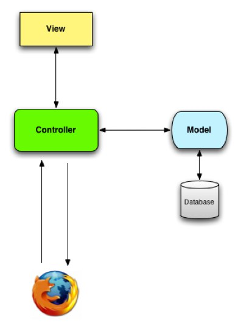

!SLIDE bullets incremental

# I/O Workflows #

* Open a socket
* Read/write to socket
* Wait for it
* Rinse and repeat

!SLIDE smaller

    @@@ruby
    require 'socket'
    server = TCPServer.new(2202)

    while client = server.accept
      msg = client.readline
      client.write msg
      client.close
    end

!SLIDE bullets incremental

# Rails Workflow #

* Request comes in
* Ask the database
* Wait for it
* Render the response

!SLIDE center

!SLIDE center

# Wait for it... #

!SLIDEl

## ZOMG, SO MUCH WAITING!!! ##

!SLIDE

## I/O blocks the flow ##

!SLIDE

## Threads? ##

!SLIDE small

    @@@ ruby
    while true
      Thread.new(server.accept) do |client|
        msg = client.readline
        client.write msg
        client.close
      end
    end

!SLIDE

## Possible, But Meh. ##

!SLIDE

## No [C10K](http://www.kegel.com/c10k.html) for you ##

!SLIDE center

# Why Evented I/O?

!SLIDE bullets incremental

## Lots of things are I/O bound ##

* little processing involved (CPU)

!SLIDE bullets small

* Proxies
* Soft Realtime Rpps
* Streaming/Firehose APIs

!SLIDE bullets small

* Messaging
* Publish/Subscribe
* Simple APIs
* Network Servers (and Clients)

!SLIDE

## Throughput > Processing ##

!SLIDE

## Awful with Blocking I/O ##

!SLIDE 

## What we really want ##

!SLIDE center

## Don't call us, we'll call you. ##
